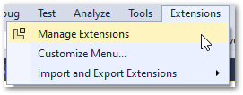

# Configuring ESP32 and .NET nanoFramework

[.NET nanoFramework](https://www.nanoframework.net/) is an open source platform that enables you to write managed 
C# code for embeded devices. For more details you can refer to the documentations at: [https://docs.nanoframework.net/]()  
For more information you can read the introduction to [.Net nanoFramework](https://docs.nanoframework.net/content/introduction/what-is-nanoframework.html)  

[ESP32](https://www.espressif.com/en/products/socs/esp32) is a fairly inexpensive and easy to use micro controller 
with integrated WiFi and blue-tooth support that can be readily purchased on ebay or online book sellers.

## What you need for this project
* Visual Studio for windows
* An ESP32 development board
* Strand of NeoPixel or any other brand controlled by a WS2812 chip
* USB power supply or battery pack and USB cable
* Some wires to connect LEDs to the dev board

## Configuring your development environment
1. For this project you need a copy of Visual Studio for Windows versions 2017, 2019, and 2022 are supported. 
If you don't have Visual Studio installed you can download a free copy of the community eddition at [https://visualstudio.microsoft.com/downloads/]()

1. Install the nanoFramework extension for Visual Studio
   * Click on Manage Extensions in the Extensions menu  
     

   * Search for nanoFramework extension and install it you will have to restart Visual Studio to finish the installation  
     

1. After install is complete open the Device Explorer by going to menu item: View > Other Windows > Device Explorer
   if your device is connected to your computer you should see something like this: (note that your device might not show up here until the next step)  
     

    There is also more details and troubleshooting guides at the [getting started guilde](https://docs.nanoframework.net/content/getting-started-guides/getting-started-managed.html)  
  

## Configure your device
Before you can start deploying your code to the ESP32 you need to flash it with the firmware that has the nanoFramework runtime we are using.

1. Make sure you have the latest .NET SDK installed by typing `dotnet --info` at command prompt. You can install the SKD from [https://dotnet.microsoft.com/download]  

1. After the SDK is installed install the nanoFirmwareFlasher by typing `dotnet tool install -g nanoff` at command prompt. Veryfy the install by typing `nanoff` at command prompt  

1. Connect your device to your computer using a USB cable  

1. Start *Device Manager* (type device manger in Windows search) and open the Ports section and note the COM port your device is connected to.  
  

1. Install the nanoFramework firmware on your ESP32 make sure to change the COM port to the correct number for your setup from the previous step.  
If this specific version is not available anymore, install the latest, but you need to make sure to update the project nuget packages to a 
version that matches the mscorlib that is included with your image  
`nanoff --update --target ESP32_REV0 --baud 115200 --fwversion 1.7.2.6 --serialport COM4`  
For more information and troubleshooting look at [this section of getting started guide](https://docs.nanoframework.net/content/getting-started-guides/getting-started-managed.html#uploading-the-firmware-to-the-board-using-nanofirmwareflasher)  

1. Connect your device to WiFi. The firmware can store your WiFi credentials with out you having to put it in your code, to do this
   * Open device explorer  
     

  * Click the Edit Network Configuration tool icon  
     

  * Selecte the WiFi-Profiles tab and enter your SSID and Password once you press OK it should connect to your network  
  

1. Upload Azure certificate, since we are going to use TLS to communicate with Azure IoT Central, we need a copy of it's certificate.
There is a copy of this in the `iot-sweater\iot-sweater-nf\config` directory of this repository.  
*Note that you might need to use a differenct certificate if you are doing this past june 2022 [see this blog for more information](https://techcommunity.microsoft.com/t5/internet-of-things-blog/azure-iot-tls-critical-changes-are-almost-here-and-why-you/ba-p/2393169)*

   * Open device explorer  
     

  * Click the Edit Network Configuration tool icon  
     

  * Navigate to the General tab and click the Browse button for **Root CA** certificate and select `BaltimoreRootCA.crt.der`  
    

  * Press OK to upload it to the ESP32 device.

At this point your device should be all ready to connect to Azure IoT Central

## Connect the LEDs

## Configure the software

